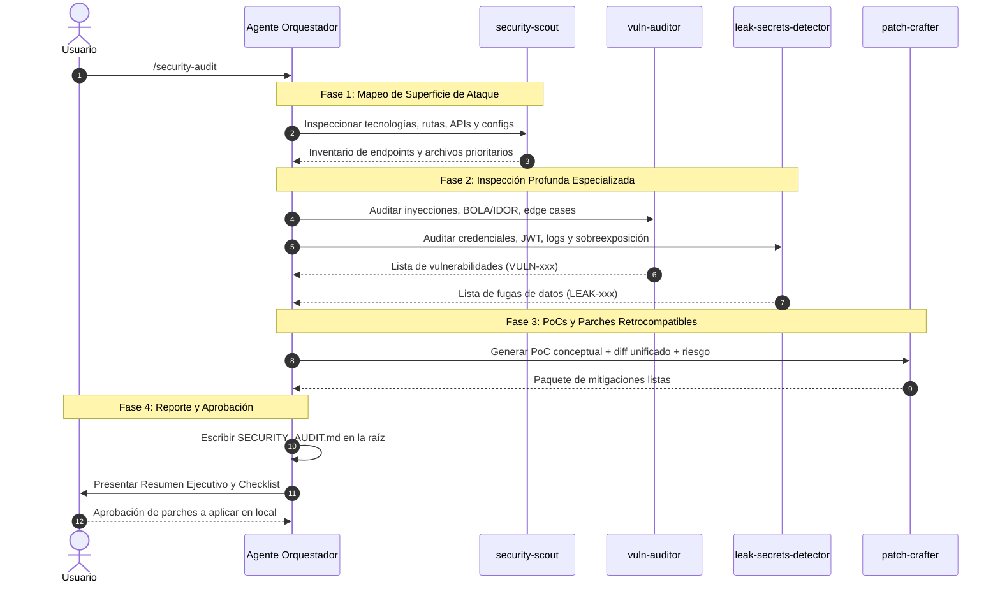

# Flujo de Auditoría de Seguridad (Security Audit Pipeline)

Este flujo de trabajo proporciona una auditoría de seguridad profunda y estructurada, orientada a proyectos legacy, aplicaciones creadas con IA/vibecoding y servicios que corren en producción (VPS) con copia local en Git.

---

## 🎯 Disparadores (Triggers)

Activa este flujo cuando el usuario use:
- El comando slash `/security-audit`
- Menciones como `@security-auditor`
- Peticiones de lenguaje natural: *"audita la seguridad de este proyecto"*, *"busca vulnerabilidades y leaks de datos"*, *"revisa edge cases de seguridad"*.

---

## 🔄 Protocolo de Orquestación en 4 Fases



---

### Fase 1: Reconocimiento (Invocación de `security-scout`)
1. Detectar archivos del proyecto (`package.json`, `requirements.txt`, archivos HTML, `.env`).
2. Mapear todas las rutas públicas vs. protegidas.
3. Listar los archivos que manejan queries a base de datos, autenticación y entrada de usuarios.

### Fase 2: Auditoría Especializada (`vuln-auditor` y `leak-secrets-detector`)
1. **Auditoría de Vulnerabilidades (`vuln-auditor`):**
   - Inyección SQL/NoSQL (queries en crudo, concatenaciones, operadores NoSQL).
   - XSS y DOM-based XSS (especialmente en React/Next/Vite con `dangerouslySetInnerHTML` o HTML nativo).
   - Control de acceso roto y BOLA/IDOR (rutas con IDs directos sin verificar sesión del usuario).
   - Server-Side Request Forgery (SSRF) y Command Injection.
   - Edge cases: tipos no validados, arrays/objetos inesperados, valores nulos.
2. **Auditoría de Fugas y Secretos (`leak-secrets-detector`):**
   - Claves de API, secrets JWT y URLs de bases de datos hardcodeadas.
   - Variables de entorno sensibles filtradas al frontend (`NEXT_PUBLIC_` o `VITE_`).
   - Logging inseguro (`console.log` de contraseñas, tokens o PII).
   - Respuestas de API con sobreexposición de datos (retornar entidades completas de BD).

### Fase 3: Elaboración de PoCs y Parches (`patch-crafter`)
Para cada hallazgo:
1. Redactar el **Escenario de Ataque / PoC Conceptual** demostrando el vector de explotación (payloads, headers o peticiones de ejemplo).
2. Diseñar el **parche de código exacto** en formato diff unificado.
3. Clasificar el **Riesgo de Regresión**:
   - **Bajo:** 100% retrocompatible con la app en producción.
   - **Medio/Alto:** Modifica contratos de API o requiere migración de datos.

### Fase 4: Consolidación y Presentación al Usuario
1. Crear el archivo `SECURITY_AUDIT.md` en la raíz del proyecto.
2. Mostrar en el chat el **Resumen Ejecutivo** y el **Checklist Interactivo**.
3. **REGLA ESTRICTA DE SEGURIDAD:** No modificar ningún archivo de código del proyecto hasta que el usuario revise y apruebe explícitamente los parches en local.

---

## 📋 Estructura Estándar de `SECURITY_AUDIT.md`

Todo reporte generado debe seguir esta estructura:

```markdown
# Reporte de Auditoría de Seguridad

**Fecha:** YYYY-MM-DD  
**Proyecto:** <Nombre del Proyecto>  
**Stack Detectado:** <Node.js / Python / HTML / etc.>  
**Estado:** Copia Local de Git (Producción en VPS)

---

## 1. Resumen Ejecutivo y Matriz de Riesgo

| ID | Vulnerabilidad / Hallazgo | Severidad | Ubicación | Riesgo Regresión |
| :--- | :--- | :--- | :--- | :--- |
| VULN-001 | Inyección SQL en endpoint de búsqueda | 🔴 Crítica | `src/routes/search.js:32` | Bajo |
| LEAK-001 | Llave privada Stripe en código fuente | 🔴 Crítica | `src/config/stripe.js:5` | Bajo |
| VULN-002 | IDOR en descarga de facturas | 🟠 Alta | `controllers/invoice.js:45`| Bajo |

---

## 2. Superficie de Ataque y Endpoints Mapeados
- **Rutas Públicas:** `/api/login`, `/api/register`, `/api/search`
- **Rutas Protegidas:** `/api/profile`, `/api/admin/*`
- **Puntos de Entrada no Sanitizados:** `req.body.query`, `req.params.id`

---

## 3. Hallazgos Detallados, PoCs y Parches Propuestos

### [ID] <Nombre de la Vulnerabilidad>
- **Severidad:** Crítica / Alta / Media / Baja
- **CWE / OWASP:** <ej. CWE-89: SQL Injection>
- **Ubicación:** `[archivo:Lxx-Lyy](file:///ruta)`

#### Vector de Ataque y PoC Conceptual
<Explicación y payload de ejemplo>

#### Causa Raíz y Edge Cases
<Por qué ocurre la falla>

#### Parche de Mitigación Propuesto
```diff
- Código original
+ Código corregido
```

#### Validación Local Pre-Deploy (VPS)
<Comandos o pasos para probar en local>

---

## 4. Checklist de Remediación
- [ ] Aplicar Parche VULN-001 (Inyección SQL)
- [ ] Aplicar Parche LEAK-001 (Rotación de Secretos)
- [ ] Aplicar Parche VULN-002 (Control de Acceso)
- [ ] Ejecutar pruebas locales antes del push a producción
```
